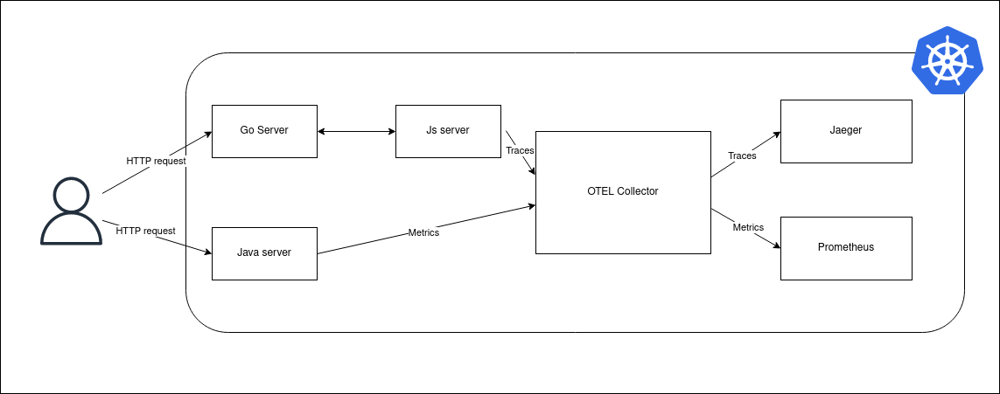

# open-telemetry-playground
Automatic instrumentation of Golang applications using Open Telemetry.   
I created this repository to learn more about OpenTelemetry and automatic instrumentation without changing the source code of microservices. During the following days i will finish this project, in turn creating a self-sufficient service capable of creating telemetry data, processing it and sending it to observability backends on both Docker (2/3 services ready) and Kubernetes (0/3).

All telemetry data is instrumented automatically. For more information, refer to [OpenTelemetry instrumentation documentation](https://opentelemetry.io/docs/instrumentation/).

K8s-open-telemetry contains all yaml files to setup the collector.

# Prerequisites:
    Kubernetes 1.24+ is required for OpenTelemetry Operator installation
    Helm 3.9+

go-server contains a go application with an HTTP server.

probe-example is an experiment conducted with kubeshark, to see from where the probes originate